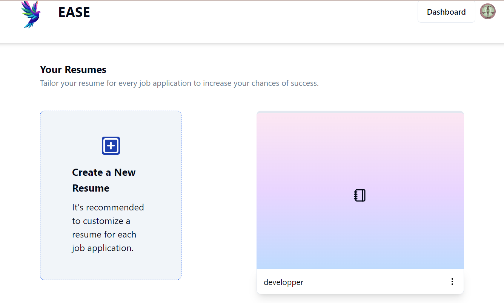

#Project Name
AI Resume Builder App

#Introduction
The AI Resume Builder App is a user-friendly web application that allows users to create, edit, and download professional resumes using AI-generated summaries. This project combines React, Vite, Tailwind CSS, and Strapi to offer a streamlined and intuitive experience for job seekers. By utilizing Clerk for authentication, users can securely manage their resumes, while the dynamic resume editing features ensure flexibility and customization.

-Deployed Site: Visit AI Resume Builder
-Final Project Blog: ...Project Overview and Learnings
-Author LinkedIn: Abdoulaye Gueye
#Installation
###Prerequisites
-Node.js (>=18.x)
-Yarn or npm
###Clone the Repository
git clone https://github.com/yourusername/ai-resume-builder.git
cd ai-resume-builder

###Install Dependencies
-npm install
or
-yarn install

#Set Up Environment Variables
Create a .env file in the root directory.
Add the necessary environment variables:

VITE_CLERK_PUBLISHABLE_KEY=pk_test_Y3J1Y2lhbC1raXQtNTIuY2xlcmsuYWNjb3VudHMuZGV2JA
###Start the Application
-npm run dev
or
-yarn dev
##Usage
-Authentication: Users must sign in using their account via Clerk.
-Create a Resume: Once logged in, navigate to the dashboard and -create a new resume.
-Edit Resume: Add personal details, AI-generated summary, experience, education, and skills.
-Download and Share: Download the resume in PDF format or share it via the provided link.
###Contributing
Contributions are welcome! Please follow these steps to contribute:

-Fork the repository.
1- Create a new feature branch (git checkout -b feature/your-feature).
2- Commit your changes (git commit -m 'Add new feature').
3- Push to the branch (git push origin feature/your-feature).
4- Create a Pull Request.
##Related Projects
-Vercel: The platform used for deployment.
-Strapi: Headless CMS used for managing resume data.
-Clerk: Authentication and user management.
##License
This project is licensed under the MIT License - see the LICENSE file for details.

